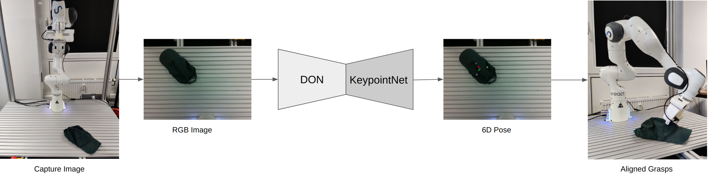

# SLOG: Single Label Object Grasping

M.Sc. Computer Science (Autonomous Systems) graduation thesis submitted to Universität Stuttgart, 2022.

## Abstract

The thesis proposes an artificial intelligence framework to develop generalized visual
object representation for robot grasping tasks.

A single label is extracted from the generalized visual object representation to identify
an object on a pixel-wise scale, acting as a robot grasping point. The generalized visual
object representations computed from Dense Object Nets (DON) are applied to compute objects’ 6D pose
to create a robust robot grasping pipeline. To eliminate the need for the manual label
extraction from the representations computed by DON, KeypointNet is implemented. The
semantic object correspondence pipeline is engineered based on generalizing capabilities
of the KeypointNet to train DON further. At the same time, the thesis identified that the
KeypointNet on its own already demonstrates the capabilities of computing generalized
visual object representation similar to DON, ushering the idea that there are other
networks capable of generalizing features.

At its core, this thesis demonstrates the reduced capabilities of networks to produce
generalized visual object representation when only trained on the synthetic dataset.
In contrast to KeypointNet training in isolation, the thesis could achieve robustness
for the KeypointNet against the object occlusions in viewpoint when trained on DON
representations in an end-to-end fashion. Furthermore, the KeypointNet trained with
DON representations autonomously picks single class generalized labels. Additionally,
computing geometrically consistent 6D poses across semantically similar objects.
Finally, the proposed framework demonstrates robustness in generalizing real-world
caps and manipulation by employing a real-world robot manipulator.

## Previews

a. KeypointNet Convergence

b. Spatial-Heatmap of tracked descriptor

